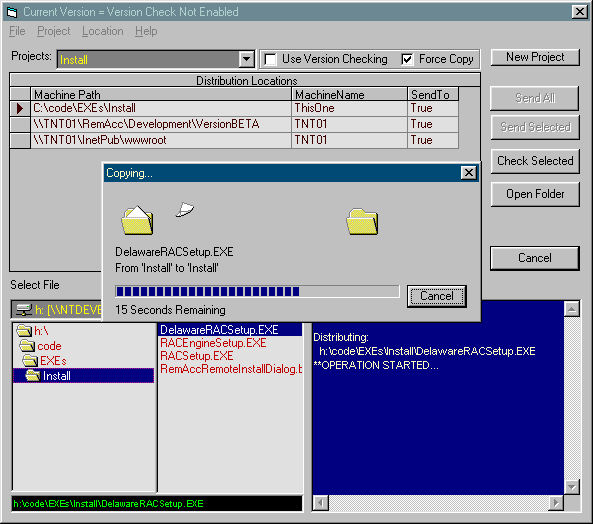



## Distribute Files

### Description

Copies a source file to predefined list of destinations.   

Mapped or UNC network paths.  

Optional Version Checking.  

Multiple Projects   

Very Useful, if you need to copy files to specific places on a regular basis, no more copy-browse-paste,Copy-browse-paste.   

Uses ADO, API  

API to show the Windows File Copy Dialog
 
### More Info
 

             |
---                |---
**Submitted On**   |2001-01-10 17:37:26
**By**             |[Bill Jones](https://github.com/Planet-Source-Code/PSCIndex/blob/master/ByAuthor/bill-jones.md)
**Level**          |Advanced
**User Rating**    |5.0 (15 globes from 3 users)
**Compatibility**  |VB 6\.0
**Category**       |[Complete Applications](https://github.com/Planet-Source-Code/PSCIndex/blob/master/ByCategory/complete-applications__1-27.md)
**World**          |[Visual Basic](https://github.com/Planet-Source-Code/PSCIndex/blob/master/ByWorld/visual-basic.md)
**Archive File**   |[CODE\_UPLOAD136701112001\.zip](https://github.com/Planet-Source-Code/bill-jones-distribute-files__1-14319/archive/master.zip)

